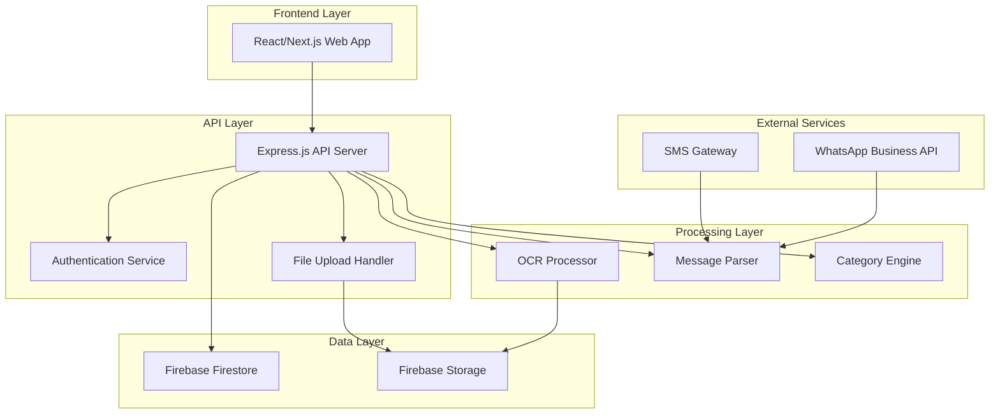

# Design Document: BillVault Expense Tracker

## Overview

BillVault is a web-based expense tracking system with a Node.js/Express API backend and React/Next.js frontend. The system automatically captures expense data from SMS/WhatsApp messages and manual image uploads, using OCR and NLP for data extraction. The architecture follows API-first design principles to support future mobile development.

### Core Architecture Principles

- **API-First Design**: All functionality exposed through RESTful Express.js endpoints
- **Microservice-Ready**: Modular components that can be separated into microservices
- **Real-time Sync**: Firebase Firestore for real-time data synchronization
- **Scalable Processing**: Asynchronous processing for OCR and message parsing
- **Security-First**: JWT tokens, encrypted data storage, and secure authentication

## Architecture

### System Architecture



### Component Architecture

The system is organized into distinct layers with clear separation of concerns:

1. **Presentation Layer**: React/Next.js web application
2. **API Layer**: Express.js REST API with route handlers
3. **Business Logic Layer**: Core processing services
4. **Data Access Layer**: Firebase integration and data models
5. **External Integration Layer**: Third-party service connectors

## Components and Interfaces

### Express.js API Server

**Core Responsibilities:**
- Route handling and request validation
- Authentication middleware
- Business logic orchestration
- Response formatting and error handling

**Key Endpoints:**
```javascript
// Authentication
POST /api/auth/send-code
POST /api/auth/verify-code
POST /api/auth/refresh-token

// Expenses
GET /api/expenses
POST /api/expenses
PUT /api/expenses/:id
DELETE /api/expenses/:id
GET /api/expenses/search

// Upload and Processing
POST /api/upload/image
POST /api/process/message

// Categories and Analytics
GET /api/categories
POST /api/categories
GET /api/analytics/spending
GET /api/analytics/trends

// Trips
GET /api/trips
POST /api/trips
PUT /api/trips/:id/activate
PUT /api/trips/:id/deactivate

// Export
GET /api/export/pdf
GET /api/export/excel
```

### Authentication Service

**Interface:**
```javascript
class AuthenticationService {
  async sendVerificationCode(phoneNumber) { /* ... */ }
  async verifyCode(phoneNumber, code) { /* ... */ }
  createJwtToken(userId) { /* ... */ }
  validateToken(token) { /* ... */ }
  async refreshToken(refreshToken) { /* ... */ }
}
```

**Integration:**
- Firebase Authentication for phone verification
- JWT tokens for session management
- Middleware for route protection

### OCR Processor

**Interface:**
```javascript
class OCRProcessor {
  async extractText(imagePath) { /* ... */ }
  async processReceipt(imagePath) { /* ... */ }
  validateImageFormat(file) { /* ... */ }
  async enhanceImageQuality(imagePath) { /* ... */ }
}
```

**Technology Options:**
- **Google Cloud Vision API**: High accuracy, good for receipts
- **Tesseract.js**: Browser and Node.js OCR library
- **AWS Textract**: Specialized for documents and receipts
- **Azure Computer Vision**: Microsoft's OCR service

### Message Parser (NLP Engine)

**Interface:**
```javascript
class MessageParser {
  async parseSms(messageText) { /* ... */ }
  async parseWhatsapp(messageText) { /* ... */ }
  extractAmount(text) { /* ... */ }
  extractMerchant(text) { /* ... */ }
  extractDate(text) { /* ... */ }
  validateExpenseData(data) { /* ... */ }
}
```

**Processing Pipeline:**
1. Text preprocessing and normalization
2. Named entity recognition for amounts and merchants
3. Date/time extraction using libraries like moment.js or date-fns
4. Confidence scoring
5. Structured data output

### Category Engine

**Interface:**
```javascript
class CategoryEngine {
  categorizeExpense(merchant, description) { /* ... */ }
  getConfidenceScore(category) { /* ... */ }
  async learnFromUserInput(expenseId, userCategory) { /* ... */ }
  getCategorySuggestions(text) { /* ... */ }
}
```

**Categorization Logic:**
- Keyword-based matching for merchants
- Natural language processing using libraries like natural or compromise
- User feedback integration for continuous improvement
- Fallback to manual categorization for low confidence

### Trip Mode Manager

**Interface:**
```javascript
class TripManager {
  async createTrip(userId, tripName, startDate) { /* ... */ }
  async activateTrip(userId, tripId) { /* ... */ }
  async deactivateTrip(userId) { /* ... */ }
  async getActiveTrip(userId) { /* ... */ }
  async assignExpenseToTrip(expenseId, tripId) { /* ... */ }
  async getTripExpenses(tripId) { /* ... */ }
}
```

## Data Models

### User Model
```javascript
class User {
  constructor() {
    this.userId = '';
    this.phoneNumber = '';
    this.createdAt = new Date();
    this.lastLogin = new Date();
    this.preferences = {};
    this.activeTripId = null;
  }
}
```

### Expense Model
```javascript
class Expense {
  constructor() {
    this.expenseId = '';
    this.userId = '';
    this.amount = 0;
    this.currency = 'USD';
    this.merchant = '';
    this.description = '';
    this.category = '';
    this.date = new Date();
    this.source = ''; // 'sms', 'whatsapp', 'manual', 'ocr'
    this.tripId = null;
    this.imageUrl = null;
    this.confidenceScore = 0;
    this.createdAt = new Date();
    this.updatedAt = new Date();
  }
}
```

### Trip Model
```javascript
class Trip {
  constructor() {
    this.tripId = '';
    this.userId = '';
    this.name = '';
    this.startDate = new Date();
    this.endDate = null;
    this.isActive = false;
    this.totalAmount = 0;
    this.expenseCount = 0;
    this.createdAt = new Date();
  }
}
```

### Category Model
```javascript
class Category {
  constructor() {
    this.categoryId = '';
    this.name = '';
    this.keywords = [];
    this.parentCategory = null;
    this.userId = null; // For custom categories
    this.isDefault = true;
  }
}
```

### Firebase Firestore Collections

```
users/
  {user_id}/
    profile: User
    expenses/
      {expense_id}: Expense
    trips/
      {trip_id}: Trip
    categories/
      {category_id}: Category

global/
  default_categories/
    {category_id}: Category
```

## Correctness Properties

*A property is a characteristic or behavior that should hold true across all valid executions of a system—essentially, a formal statement about what the system should do. Properties serve as the bridge between human-readable specifications and machine-verifiable correctness guarantees.*

Before defining the correctness properties, I need to analyze the acceptance criteria from the requirements to determine which ones are testable as properties.